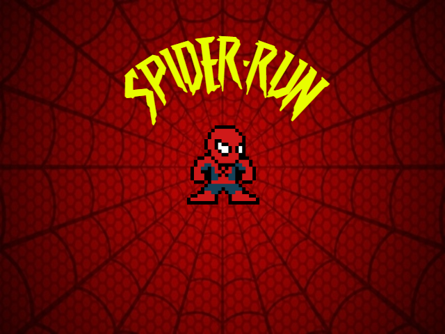

# SpiderRun

Este repositorio contiene el código fuente del proyecto final para la materia **Programación Orientada a Objetos** en la **Facultad de Ingeniería y Ciencias Hídricas (FICH) de la Universidad Nacional del Litoral (UNL)**.

## Descripción del Proyecto

El proyecto es un juego desarrollado en C++ utilizando la biblioteca **SFML (Simple and Fast Multimedia Library)**. El juego se inspira en el clásico "Dino Run" de Google, pero con una temática basada en el universo de **Spider-Man**.

### Características del Juego
- **Mecánicas de juego**: El jugador controla a Spider-Man, quien debe esquivar obstáculos en su camino saltando.
- **Desarrollo**: Utiliza conceptos de programación orientada a objetos, como clases, herencia, y polimorfismo, para organizar el código y las funcionalidades del juego.

  Menú Inicial: 

  Pantalla Game Over: 

